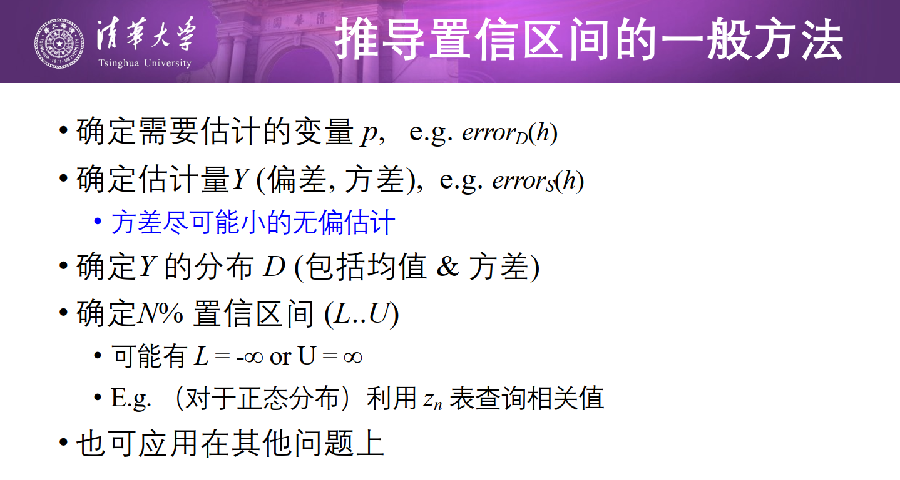

图片来自于张敏老师的ppt

# 2.General Sys Design

机器学习三个要素： T E P

Task  Experience  Performance

系统设计：

1. 用于训练的经验。 注意训练数据偏差
2. 应该学什么。 定义**目标函数**。注意正确性和可行性。为了可行性，这里可以有近似/假设 ~  作为评估。比如评估函数$V$的近似$\hat V$。
3. 假设的表示。好的近似，注意对数据的要求。
4. 学习算法。综合特征和学习目标选择。比如Least MSE $\sum_{training\ set} (V_{train}(b) - \hat V (b))^2$

即：数据 特征 表示 算法 评价

- 实例空间X（属性描述）  
- 假设空间H（比如我们根据属性，做出的决策树，if xxx then do xxx）  
- 训练样例空间D  
- 目标概念C 
- 训练集中的样本形如$<x_i,c(x_i)>$

我们要做的事情可以描述为 求一个假设$h\in H$，满足$h(x)=c(x) \ for \ all\  x \in X$

如果有n个属性，那么实例空间就有$2^n$个元素（每个属性yes or no），假设空间至多$2^{2^n}$个元素（顶多每个实例都在假设中作为正例or负例出现）

# 3.Decision Tree

找下一步最佳决策属性（为了使决策树尽量简洁，occam‘s razor），派生出来的节点数据尽量纯（分得尽量开），减小混杂度（即熵）

## ID3

熵Entropy（注意是取负号，最终是正的！另外注意这里是2为底）:
$$
Entropy(N) = - \sum_j P(w_j) \log_2 P(w_j)
$$
选择最佳决策属性的时候，要找最大化**信息增益**的属性：
$$
Gain(S,A) = Entropy(S) - \sum_{v\in Values(A)} {|S_v|\over |S|} Entropy(S_v)
$$
S是样本（包括正例和负例）。 信息增益 = 原始S的熵值 - 经过属性A分类以后的期望熵值（两个子节点熵的加权平均）

停止（完美分类）的判断：子集输入全相同 或者 输出全相同

算的是局部最优

## 过拟合

$h \in H$过拟合的定义：存在另一个假设$h'\in H$，使得$err_{train}(h) < err_{train}(h')$，并且$err_{test}(h) > err_{test}(h')$。（h'训练集上更劣，但测试集上更优）

应对过拟合：预剪枝（一个节点的训练**样本数目**太少的时候，or基于**信息增益**的阈值：信息增益太小的时候），后剪枝（**错误降低剪枝**：如果剪掉可以提高验证集准确度，就剪掉；和**规则后剪枝**）

**规则后剪枝**：将树转换为若干条等价的规则集合；考虑每条规则，去掉一些规则前件来提高该规则准确率；按准确率从高到低对所有规则排序；predict的时候，依次查看是否满足每条规则

如果一个叶子节点子集有多个输入，那么可以该叶子节点赋值成最常见的label。

当ID3某一属性取值太多了，他更容易被优先选择，可以用信息增益比代替信息增益，信息增益比就是信息增益除以S在A的熵:
$$
GainRatio(S,A) =  {Gain(S,A) \over SplitInformation(S,A)} \\
SplitInformation(S,A) = -\sum_{i=1}^c {|S_i|\over |S|} \log_2 {|S_i|\over |S|}
$$
除数那项就是S在A属性的熵，注意和之前的熵不一样（之前的$E(S)$是靠正例和负例划分的）

# 4.Bayesian

归纳学习假设：任一假设若在足够大的训练样例集中很好地逼近目标函数，它也能在未见实例中很好地逼近目标函数  

贝叶斯定理：用先验概率推断后验概率
$$
P(h|D) = {P(D|h) P(h) \over P(D)}
$$
h是得癌症，D是化验结果为阳性。P(h)是h的先验概率。P(D)是D的先验概率，要与h相互独立。

$P(h|D)$是h的后验概率（已经有了D这个结果，就是后验）。

$P(D|h)$是似然度 likelihood。常常用对数似然 $\log(P(D|h))$

## MAP

Maximum A Posteriori (MAP): (极大后验假设)  ：给定训练集，因此$P(D)$固定
$$
h_{MAP}=\arg\max_{h\in H} P(h|D) = \arg\max_{h\in H}{P(D|h) P(h) \over P(D)}=\arg\max_{h\in H} P(D|h) P(h)
$$
根据$P(D|h) P(h)$来选择最大值

另外还有一个MDL，最小描述长度

## ML

Maximum Likelihood, ML, 极大似然假设

MAP里面$h_{MAP}=\arg\max_{h\in H} P(D|h) P(h)$ ，如果完全不知道假设h的概率分布（假设h的概率分布P(h)是均匀的），那么有极大似然假设：
$$
h_{ML} = \arg \max_{h_i\in H} P(D|h_i)
$$

极大似然&最小二乘是有联系的，独立随机变量，正态分布噪声$N(0,\sigma^2)$的条件下$h_{ML}=h_{LSE}$。

## 朴素贝叶斯NB

每个属性独立

目标函数$f: X\rightarrow V$，每个样本$x=(a_1,\dots,a_n)$，那么最有可能的$f(x)$值是：
$$
v_{MAP} = \arg\max_{v_j\in V} P(x|v_j) P(v_j)
$$
假设每个属性独立，那么$P(x|v_j ) = P(a_1, \dots a_n | v_j) = \prod_i P(a_i|v_j)$

So:
$$
v_{NB} = \arg\max_{v_j \in V} P(v_j) \prod_i P(a_i|v_j) = \arg\max_{v_j \in V} (\log P(v_j) +\sum_i \log P(a_i|v_j))
$$

# 5.IBL

Instance-based Learning  

之前的模型都是这样的方法：估计问题特性；作出模型假设；找到最优参数

IBL的动机就是：人类回忆、类比来推理

参数化与非参数化：

参数化：设定一个函数形式，简单，但可能存在很大的偏置（实际不符合假设）。比如RL的Q-function

非参数化：分布和密度的估计是data-driven的，不需要事先对函数形式作估计

IBL无需构建模型，只需存储所有训练样例，需要predict的时候才开始处理

## 最近邻，k近邻

相似度--距离函数，找训练样例中相似度最高的

1-NN 的错误率不大于 Bayes 方法错误率的 2 倍  

KNN：找最近的K个点，进行投票

每个属性值范围不一样，所以要进行归一化，归一化到[0,1]。

还要在计算距离时，对每个属性之差进行加权，再加和

效率方面：使用KD-tree。

需要找一个合适的距离函数。另外，不相关的特征 对距离的度量有负面的影响 。

## 距离加权KNN

每个邻居的贡献不一样，考虑对数据加权，更接近的邻居赋予更大的权重。
$$
w_i = K(d(x_i,x_q))
$$
$x_q$是待查询点。K是核函数，与距离成反比，常用的核函数有$1/d^2, e^{-d}, 1/(1+d), e^{-(d/\sigma)^2}$。这里$\sigma$是核宽度$K_w$

输出是加权平均： ${ \sum w_i y_i\over \sum w_i}$  （难道这里指的是回归问题，label是连续的值???） 我的理解是，$w_i$不就是权函数吗，投票的时候算权重

# 6.Unsupervised Learning

积极学习：训一个模型，假设。训练时间长，测试时间短。倾向于给出全局估计。

懒惰学习：基于实例的学习。可以给出局部估计。

相比有标注的有监督学习关注条件分布$P(Y|X)$，无监督学习关注联合分布$P(X)$

半监督学习则是通过少量的有标注数据和很多无标注数据来学习条件分布$P(Y|X)$

无监督学习主要在于发现无标注数据的结构、输入的合理表示等

## 聚类

好的聚类：类内距离小 类间距离大

软聚类：同一对象可以属于多个类

硬聚类：同一对象只能属于一个类

层次聚类 vs. 非层次聚类
层次： 一个所有类间的层次结构（tree）
非层次： 平的，只有一层  

聚类也需要衡量对象间的距离（相似度）。对于非数值数据，可以采用相似度矩阵。数值数据可以直接用某种距离计算。

## K-means

1. 随机选K个种子，作为类中心，使得$d(g_i,g_j)>d_{min}$
2. 根据最近距离把各个点分配给各个类
3. 计算新的类中心（直接每个类取点均值），然后重复2-3步

通过迭代的方法聚类，不一定能找到最优解。是硬聚类、非层次

对噪声和离群点敏感

## K-medoids

在上面的第3步中，不用类均值，而用最靠近类中心的点。

当存在噪音和孤立点时, K-medoids 比 K-means 更鲁棒。K-medoids 对于小数据集工作得很好, 但不能很好地用于大数据集  

而**PAM**则是在第3步中，随机用一个非中心对象替换类中心，类的质量提高了就保留。

衡量好坏/取最靠近类中心的点都用的是代价函数，即类内对象与类中心的平均不相似度  

基于大样本有个改进算法：CLARA：每次随机选取样本量中的一小部分进行PAM聚类（确定了中心）。将剩余样本按照最小中心距离进行归类。多次重复取误差最小。

# 7.Hypo eval

K-means的形式化：
$$
\min\ J={1 \over N} \sum_{n=1}^N \sum_{v=1}^K r_{nv} ||u_n - g_v||^2
$$
N个点，K个类，$r_{nv}$是one-hot向量，表示每个点是否在各个类中，$u_n$是每个点，$g_v$是每个类中心。

可以通过轮流更新的方法来最小化。1.固定$g_v$优化$r_{nv}$。 2.固定$r_{nv}$优化$g_v$。实际上和之前K-means的步骤是一样的。

## 凝聚式层次聚类算法  

一开始每个点单独属于一个类，然后不断将最相似的两个类合并，直至最后剩下k个类。

类之间的相似度可以用 （最近点对、最远点对、距离平均值）来衡量

这样凝聚的过程可以看作是一棵树。

## 机器学习理论

### 假设评估

真实误分类的概率：$error_D(h)=p$，现在考虑测试的时候，n个随机样本，有r个被误分类这个事件。

测试集~S，误分类$error_S(h) = {r \over n}$

r个被误分类，r这个随机变量的分布是个二项分布。
$$
E[r] = np, \quad E[error_S(h)]=np/n=p, \\
\sigma_{error_S(h)}={\sigma_r \over n} = {\sqrt{np(1-p)} \over n} = \sqrt{error_D(h)(1-error_D(h))\over n} \approx \sqrt{error_S(h)(1-error_S(h))\over n}
$$

我现在是拿测试集上的误分类率$error_S(h)$来估计真实的误分类率$error_D(h)$

估计的bias： 
$$
bias = E[error_S(h)] - error_D(h)
$$
如果S是训练集，那结果是有偏的（偏乐观，因为训练集上面的误分类概率更小），所以不要在训练集上面做测试

即使是无偏估计，$error_S(h)$和$error_D(h)$也有可能不一样，因为只是期望一样，另外还有方差的存在。

需要选择无偏且有最小方差的估计

# 8.Hypo eval II

足够大的样本集合，二项分布可以很好地近似正态分布

## errorS的分布

考虑95%置信区间，有95%的概率$error_S(h)$落在区间$error_D(h) \pm z_N\sqrt{error_D(h)(1-error_D(h))\over n}$。  注意这里是用S来估计D，D是无偏估计下S的期望。

$z_N=1.96$ (95%)

等价于$error_D(h)$落在区间$error_S(h) \pm z_N\sqrt{error_D(h)(1-error_D(h))\over n}$

近似等于$error_S(h) \pm z_N\sqrt{error_S(h)(1-error_S(h))\over n}$

为了确定Y的分布D，可以考虑中心极限定理：IID的随机变量$Y_1,\dots,Y_n$，那么$\hat Y = {1\over N} \sum_{i=1}^N Y_i$ 服从正态分布$N(\mu, \sigma^2/n)$

## 假设间的错误率差异

### z检验

现在想比较两个假设h1和h2的错误率差异。

在样本集合$S_1$上测试$h_1$，在样本集合$S_2$上测试$h_2$

要估计的参数便是$d=error_D(h_1) - error_D(h_2)$

选择无偏估计量 $\hat d = error_{S_1}(h_1) - error_{S_2}(h_2)$， 两项都服从正态分布，$\hat d$也近似正态分布，均值为$d$，方差为两个方差的和
$$
\sigma_{\hat d } = \sqrt{{error_{S_1}(h_1)(1-error_{S_1}(h_1))\over n_1} + {error_{S_2}(h_2)(1-error_{S_2}(h_2))\over n_2}}
$$
$\hat d$有$N\%$的概率落在$d \pm z_N \sigma_{\hat d}$区间，也可以反过来想d的区间...

一般是给定$\hat d=0.1$，问$d>0$的概率，那么就是$\hat d$落在$\hat d < d + 0.1 = \mu_{\hat d } + 0.1 = \mu_{\hat d } + \sigma_{\hat d }* {0.1 \over \sigma_{\hat d }} = \mu_{\hat d } + \sigma_{\hat d }* z_N$的概率，可以算出$z_N$进而推出概率，注意这里是单边置信区间，要转换概率为单边。

### t检验

考虑k折交叉验证，有训练集和测试集同时存在。

$L(S_0)$表示使用学习算法$L$在训练集$S_0$ 上进行训练得到的假设

$error_{T_0}(L_A(S_0))$里面的$T_0$便是测试集

k折交叉验证：在同一个子集上对比A和B算法
$$
i=1,\dots k\\
h_A \leftarrow L_A(S_i) \\
h_B \leftarrow L_B(S_i) \\
\delta_i = error_{T_i}(h_A)  - error_{T_i}(h_B)
$$
为了比较两算法，考虑$\bar \delta = {1\over k }\sum_{i=1}^k\delta_i$

那么对d的N%置信区间估计就是$\bar \delta\pm t_{N,k-1} s_{\bar \delta}$， k-1是自由度

其中$s_{\bar \delta} = \sqrt{{1\over k(k-1)} \sum_{i=1}^k (\delta_i - \bar \delta)^2}$

# 9.SVM

定义间隔：超平面往两边扩展到最近点，形成的最大宽度。

最大间隔线性分类器：具有最大间隔的线形分类器。 

边界上的点就是支持向量

$f(x_i,\alpha)=<x_i,w> + b$，对于正例$y_i=+1$，需要$f\ge 1$。对于负例$y_i=-1$，需要$f\le -1$。

分类超平面就是$<x,w>+b=0$，平行于他的、支持向量所在的超平面就是$<x,w>+b=\pm 1$

现在这里定义的间隔是两个新的超平面之间的距离，即$<x,w>+b=1$到原点的距离$\rho_1$与$<x,w>+b=-1$到原点的距离$\rho_2$差的绝对值$|\rho_1-\rho_2|$

**最大化间隔**，即$\max_{w,b} {2 \over ||w||_2}\quad s.t.\ y_i(<x_i,w>+b)\ge 1\quad \forall i=1,...,N$，

其中$w$是原点指向$<x,w>+b=1$的单位向量，就是超平面中的w。又可以转化为$\min_{w,b} {1\over 2}||w||_2^2$

对偶问题...

线性不可分的情况：
$$
\min_{w,b} {1\over 2}||w||_2^2 +C * (loss\ for\ errors)
$$
C是用来平衡loss和前者的常数

软间隔
$$
\min_{w,b,\epsilon_i} {1\over 2}||w||_2^2 +C * \sum_{i=1}^N\epsilon_i \quad s.t.\ y_i(<w,x_i>+b)\ge 1-\epsilon_i, \ \epsilon_i\ge 0 \quad \forall i=1,...,N
$$
$\epsilon_i=0$ 则说明数据点在边界or间隔区域外侧且正确分类的一侧。$0 < \epsilon_i \le 1$，说明数据点在正确分类的一侧但在间隔区域内。$\epsilon_i>1$说明数据点在错误分类的一侧。（$0 < \epsilon_i < 2$说明在间隔区域内）

C较大偏向于错误小，C较小偏向于间隔大。**最大化间隔且最小化分类错误  **

线性可分情况下的对偶问题：
$$
\min_{\alpha_i }{1\over 2} \sum_{i,j}\alpha_i \alpha_j y_i y_j <x_i,x_j> - \sum_i \alpha_i  \qquad s.t. \sum_i y_i \alpha_i = 0, \alpha_i \ge 0, \quad \forall i=1...N
$$
线性不可分的情况下要求$0 \le \alpha_i\le C$

## 核函数

$$
\Phi(x): R^n\rightarrow F
$$

输入空间到特征空间的映射，使得样本在特征空间中线性可分

实际上只需要知道$<\Phi(x),\Phi(y)>$，那么定义一个核函数$k(x,y)=<\Phi(x),\Phi(y)>$即可

三种构造核函数的方法：

1. 选特征函数$\Phi(\cdot)$，然后构造$k(x,x')=<\Phi(x),\Phi(x')>$
2. 直接选一个合理的核函数
3. 利用简单核函数通过简单的变换构造新的核函数

# 10.Ensemble Learning

分类器的效果不能太差，而且要不同

强学习器: 有高准确度的学习算法
弱学习器: 在任何训练集上可以做到比随机预测略好  

思想：单个分类器表现不好，但是他们的**加权融合**表现好。 （算法池中每个学习器都有一个权重）。投票的时候选**加权多数**

对弱学习器的要求：不稳定，简单（高效拟合，predict快），模型小（避免过拟合）

Bootstrap sampling (拔靴法/自举法采样)  ：$|D|=m$，通过从D中均匀随机的**有放回采样**m个样本构建 Di  

## bagging

t=1...T

- 从S中拔靴采样产生 Dt  
- 在 Dt 上训练一个分类器Ht 

predict时，Ht多数投票（等权重）

在学习器不稳定（训练集小的差异可以使得产生的假设大不相同）的时候有用，比如决策树、神经网络

## Adaboost

关注错误分类样本，调整权重来不断训练分类器。（错误分类样本的权重需要提高）

需要调的参数只有循环次数T

Adaboost较容易受到噪声的影响。在弱学习器太复杂（易过拟合）和太弱的情况下会失效

# 11.Deep Learning

## 激活函数

sigmoid:
$$
f(z) = { 1 \over 1 + e^{-z}}
$$
tanh:
$$
f(z) = \tanh(z) = {e^z - e^{-z} \over e^z + e^{-z}}
$$
回忆：$\sinh(z) = {e^z - e^{-z} \over 2},  \cosh(z) = {e^z + e^{-z} \over 2}$

ReLU:
$$
f(z) = \max(0,z)
$$

激活函数为神经元引入了非线性因素，使得神经网络可以逼近任何非线性函数

## 损失函数/误差函数

$$
E={1\over N} \sum_{n=1}^N E^{(n)}
$$

$E^{(n)}$是每个输入样例n的损失函数

MSE（注意${1 \over 2}$）：
$$
E^{(n)} = {1\over 2} \sum_{k=1}^K (t_k-y_k^{(L)})^2
$$
适用：回归、ReLU（不适合Sigmoid，因为梯度消失问题）

交叉熵：

回顾一般的交叉熵的公式：
$$
H(p,q) = -\sum_{i=1}^n p(x_i) \log(q(x_i))
$$

$$
E^{(n)} = - \sum_{k=1}^K t_k \ln y_k^{(L)} \\
y_k^{(L)} = {\exp(z_k) \over \sum_{j=1}^K \exp(z_j)}
$$

$z_j$是linear层的裸输出

适用：分类，softmax/sigmoid

## 特色

MLP：全连接

CNN:

局部连接以及权重共享  （权重共享极大减少了网络的训练参数，使NN结构更简单，适应性更强  ）

RNN：动态系统，可以使神经元的状态随时间变化。有梯度消失的问题，解决长序列输入问题是困难的

LSTM：设计了门，来避免梯度消失。参数太多，可能导致过拟合

GRU：整合了一下门，混合了输出状态和隐藏状态，只有一个输出向量。比LSTM参数更少  

DL：

• 可能是处理大量数据的一个较好选择
• 模型太大可能是个问题——需要并行计算
• 理论基础欠缺
• 缺少可解释性
• 对恶意攻击不鲁棒  

# 12.MM&HMM

## MM

马尔科夫模型：

数据序列：$D=\{x_1,\dots,x_N\}$，样例之间具有依赖关系
$$
p(D|\mathcal{M}) = p(x_N,x_{N-1},\dots,x_1) = p(x_1) \prod_{n=2}^N p(x_n|x_{1:n-1})
$$

一阶马尔科夫假设：n时刻的观察值只依赖于n-1时刻的观察值。$p(x_n|x_{n-1},\dots,x_1) \approx p(x_n|x_{n-1})$

转移概率$a_{ij}=p(x_n=S_j | x_{n-1}=S_i)$，从状态i转移到状态j的概率。这里便可以导出一些性质：

- 时间不变性：$a_{ij}=p(x_n=S_j | x_{n-1}=S_i)=p(x_{n+T}=S_j | x_{n-1+T}=S_i)$
- 行和为1： $\sum_{j=1}^M a_{i,j} = 1$。  a这个矩阵，左边（行）代表今天，上面（列）代表明天

不知道转移矩阵的话就从观察序列中学习

## HMM

就是observation -- state，观察到的状态和隐藏状态之间的差别

观察值：$O=\{o_i\}$，隐藏状态：$S=\{s_i\}$

有两个概率: 状态转移概率$a_{ij}=p(x_n=S_j | x_{n-1}=S_i)$。  输出概率$b_{ij}=p(y_n=O_j|x_n=S_i)$

不同于MM只有两个假设，HMM有三个假设：马尔科夫假设（一阶），时间不变性假设，**输出独立性假设**（输出只与当前状态有关）

三个基本问题：

- 评估问题（给定观察值序列，求观察值序列的概率）
- 解码问题（给定观察值序列，求可能性最大的状态序列）~viterbi (上面相当于对所有状态序列求和，这里相当于取max)
- 学习问题（给定观察值序列，调整参数$\mu$使得观察值序列的出现概率最大）

问题一：DP，定义$\alpha_t(i)=P(o_1,...,o_t,x_t=i|\mu)$

1~t时刻的观测状态是oi，状态x_t已经确定为i的概率
$$
\alpha_{t+1}(j) = \sum_{i=1...N} \alpha_t(i) * a_{ij} *b_{j,o_{t+1}}
$$
最后的$P(O|\mu)= \sum_{i=1}^N \alpha_T(i)$

$\alpha_1(i) = \pi_{i}$

# 13.Computaitional Learning Theory

可能近似正确学习 Probably Approximately Correct (PAC)  Learning  

真实错误率： $error_D(h) = P_{x\in D}[c(x)\neq h(x)]$

与目标c和分布D有关

PAC刻画  -- 合理数量的训练样本  合理的计算量

考虑错误率参数$\epsilon$ （不要求学习器输出零错误率假设，即近似），置信参数$\delta$ （不再要求学习器对所有随机抽取样例序列都能成功，即可能0。注意$\delta$是失败的概率）

总结一下参数：

- 训练样例：$\{(x_i,c(x_i))\}_{i=1}^n$
- 目标概念C
- 分布D
- 控制参数$\epsilon, \delta$
- 学习算法$L$
- 输出的假设$h$

有效性(Effectiveness): L必须以任意高概率 $(1-\delta)$ 输出一个错误率任意低$(\epsilon)$的假设

高效性(Efficiency):  L的学习时间最多以多项式方式增长 （是${1\over \epsilon},{1\over \delta},n,size(c)$的多项式函数，n定义了实例空间大小）

满足这两点称作PAC可学习的

## 样本复杂度

三种产生样例的方式：

1. 由学习器向教师提出查询
   • 学习器提出实例 x, 教师给出相应的 c(x)

2. 由教师（知道目标概念c ）选择样例
   • 教师提供样例序列 <x, c(x)>

3. 随机选择实例，教师来提供标注
   • 实例 x 是随机产生的, 教师提供 c(x)

## 有限假设空间

### 一致学习器

一致学习器(consistent learner)：一个学习器是一致的(consistent)，当它只要在可能时都输出能**完美拟合训练数据**的假设  。记为$Consistent(h,D)$。注意这里的D是训练集。

version space：假设空间H中一致的那些h
$$
VS_{H,D}=\{h \in H| Consistent(h,D)\}
$$

$\epsilon$详尽：$\forall h\in VS_{H,D}: \ error_{\mathcal{D}}(h) < \epsilon$， （注意这里errorD是真实错误率，D是花体。在训练集中一致无误，在真实错误率上小于$\epsilon$）

定理：version space的$\epsilon$详尽化

假设空间H有限，且D为目标概念c的$m\ge 1$个独立随机抽取的样例。对于任意$\epsilon\in[0,1]$，$VS_{H,D}$不是$\epsilon$详尽的概率小于等于$|H|e^{-\epsilon m}$

（即m个训练样例不能把坏的假设剔除出去的概率  ）

现在考虑有多少训练样例才能以概率$1-\delta$保证H中每个零训练错误率的假设的真实错误率最多为$\epsilon$  

$$
m\ge {1\over \epsilon}(\ln |H| + \ln {1\over \delta})
$$

### 不可知学习器

如果H不包含目标概念c，则并不总能找到零错误率假设（做不到一致）。不可知学习器( Agnostic Learner)只寻找具有最小训练错误率的假设  。

$$
m\ge {1\over 2\epsilon^2}(\ln |H| + \ln {1\over \delta})
$$

## 无限假设空间

——基于VC维

二分：分为两个子集，一个子集的$h(x)=1$，另一个子集的$h(x)=0$

实例集合的打散 ：S的每个二分，都对应到H中的某个假设 （比如，如果假设空间是决策树对应的布尔表达式，那么）

VC维：$VC(H)$是可被H打散的X的最大有限子集的大小。（如果X的任意有限大的子集可被H打散，那VC维就是无穷）

VC维度量机器学习算法的假设空间的表示能力。VC 维小 = 算法能力更弱  

子集可以随便选一个，但是选到的子集要遍历所有的二分(所有标正负例的情况都要遍历到)

看例题。
$$
m\ge {1\over \epsilon}(4\log_2 (2/\delta) + 8VC(H) \log_2(13/\epsilon))
$$
